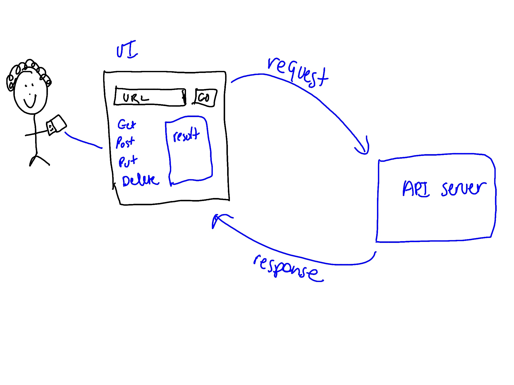

# resty

This project contains an application which is an API testing tool.

### Author: Marlene Rinker

- [Submission PR](https://github.com/marlenerinker-401-advanced-javascript/resty/pull/3)
- [Tests Report](https://github.com/marlenerinker-401-advanced-javascript/resty/actions)
- [GitHub Pages deployment](https://marlenerinker-401-advanced-javascript.github.io/resty/)

### Setup

#### `.env` requirements
No `.env` requirements at this time.

#### Packages to Install
(See package.json)

- eslint-plugin-react
- node-sass
- react
- react-dom
- react-scripts
- enzyme
- enzyme-adapter-react-16
- gh-pages
- react-test-renderer

#### Running the app
npm start

#### Tests

- Unit Tests: `npm test` (run from the `__tests__` folder to run all tests)

- Assertions Made: -->
  - Test that the form renders when the application starts
  - Test that the state is updated when the user clicks GET
  - Test that the state is updated when the user clicks POST
  - Test that the state is updated when the user clicks PUT
  - Test that the state is updated when the user clicks DELETE
  - Test that the state is updated when the user enters a URL
  - Test that the display is updated when the user clicks GO!
  - Test that the displayed form matches the snapshot

#### UML
